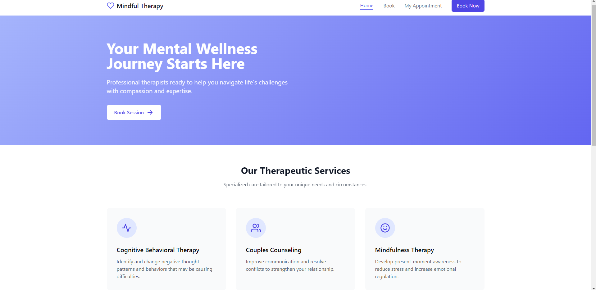

# Therapy Booking App



An appointment booking app built with **Django**. Clients can browse available time slots, book a 1‑hour therapy session, view their booking using a reference code, and cancel if needed.

---

## ✨ Features

* **Smart availability**:

  * Working days: Monday–Saturday
  * Time slots: **09:00, 10:00, 11:00, 14:00, 15:00, 16:00**
  * Past times are automatically unavailable for the current day
  * Double‑booking protection via DB uniqueness + atomic transactions
* **Two‑week calendar** on the booking page (this week + next week) with disabled/full slots dimmed.
* **Booking confirmation** page shows a one‑time **reference code** (also stored in a cookie for convenience).
* **Self-service cancellation** with reference code verification.
* **Clean UX**: Tailwind UI, AOS animations, Feather icons.
---

## 🏗️ Tech Stack

* **Frontend**: Tailwind CSS (CDN), AOS, Feather Icons
* **Backend**: Django
* **DB**: Any Django‑supported RDBMS (SQLite out of the box)

---

## 🚀 Quick Start

### 1) Clone & create a virtual environment

```bash
git clone https://github.com/Falorenthebad/therapy-booking-app.git
cd therapy-booking-app
```

### 2) Install dependencies

```bash
pip install -r requirements.txt
```

### 3) Migrate & run

```bash
python manage.py makemigrations
python manage.py migrate
python manage.py runserver
```

Open [http://127.0.0.1:8000/](http://127.0.0.1:8000/) in your browser.

---
